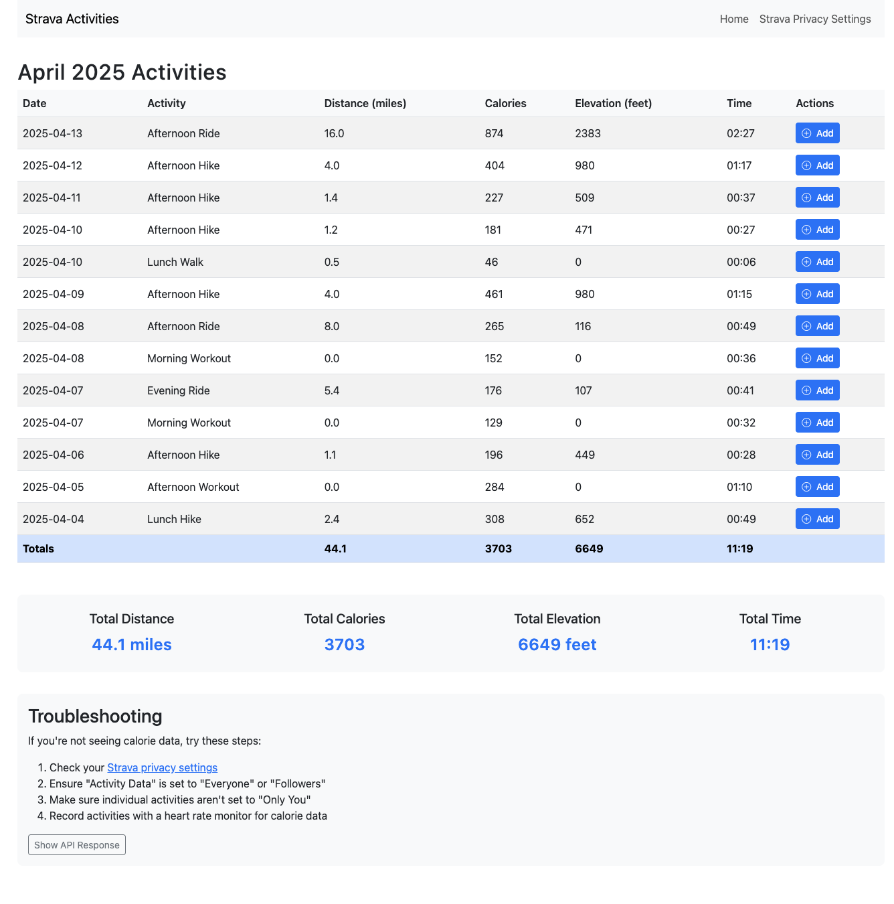

# Strava Activity Metrics App

A simple web application that connects to the Strava API to display your activity metrics for April 2025.



## Features

- OAuth authentication with Strava
- Displays a table of all activities for April 2025
- Shows activity details including:
  - Date
  - Activity name
  - Distance (in miles)
  - Calories burned
  - Elevation gain (in feet)
  - Moving time (in hours:minutes format)
- Calculates and displays monthly totals for all metrics
- Detailed activity view with raw API data for debugging
- Responsive design that works on mobile and desktop
- Integration with graph.yt for activity tracking

## Environment Variables

The application requires the following environment variables to be set in a `.env` file:

### Strava API Credentials
- `STRAVA_CLIENT_ID`: Your Strava API client ID
- `STRAVA_CLIENT_SECRET`: Your Strava API client secret

### Graph.yt Cookie Values
- `GRAPH_YT_CHALLENGE`: The challenge cookie value for graph.yt authentication
- `GRAPH_YT_PHPSESSID`: The PHP session ID cookie value for graph.yt authentication

### Flask Configuration
- `FLASK_ENV`: Environment setting (development/production)
- `FLASK_DEBUG`: Debug mode setting (1 for development, 0 for production)
- `SECRET_KEY`: Flask secret key for session security

## Metrics Displayed

The application displays the following metrics for each activity:

| Metric | Description | Unit |
|--------|-------------|------|
| Date | The date the activity was performed | YYYY-MM-DD |
| Activity | The name of the activity | Text |
| Distance | The total distance covered | Miles |
| Calories | The estimated calories burned | Number or "N/A" if not available |
| Elevation Gain | The total elevation climbed | Feet |
| Time | The moving time (excluding pauses) | Hours:Minutes (HH:MM) |

The application also calculates and displays monthly totals for:
- Total distance
- Total calories burned
- Total elevation gain
- Total moving time

## Setup

1. Create a Strava API application at https://www.strava.com/settings/api
2. Clone this repository
3. Create a `.env` file with your credentials:
   ```
   # Strava API Credentials
   STRAVA_CLIENT_ID=your_client_id
   STRAVA_CLIENT_SECRET=your_client_secret

   # Graph.yt Cookie Values
   GRAPH_YT_CHALLENGE=your_challenge_cookie
   GRAPH_YT_PHPSESSID=your_phpsessid_cookie

   # Flask Configuration
   FLASK_ENV=development
   FLASK_DEBUG=1
   SECRET_KEY=your_secret_key
   ```
4. Install dependencies:
   ```
   pip install -r requirements.txt
   ```
5. Run the application:
   ```
   python app.py
   ```
6. Open your browser and navigate to http://localhost:5000

## Requirements

- Python 3.6+
- Flask
- Requests
- python-dotenv

## Notes

- The application requires authorization from your Strava account to access your activity data
- Calorie data may not be available for all activities, depending on your device and privacy settings
- The application displays data in imperial units (miles and feet)
- Time is displayed in hours and minutes format (HH:MM)
- The application uses graph.yt for activity tracking, requiring valid cookie values

## Strava Privacy Settings for Calories

To ensure calorie data is displayed correctly, you need to configure your Strava privacy settings:

1. **Account Privacy Settings**:
   - Go to Settings > Privacy Controls
   - Set "Activity Data" to "Everyone" or "Followers"
   - Ensure "Calories" is not hidden in the "Hide My Stats" section

2. **Individual Activity Privacy**:
   - For each activity, check that the privacy setting is not set to "Only You"
   - You can change this in the activity details page

3. **Device Settings**:
   - Calorie data is typically only available when activities are recorded with a heart rate monitor
   - Make sure your device (like Apple Watch, Garmin, etc.) is set to track and sync heart rate data

4. **API Permissions**:
   - The application requests the `activity:read_all` and `profile:read_all` scopes
   - You may need to reauthorize the application if you've previously authorized it with fewer permissions

If you're still not seeing calorie data after checking these settings, try reauthorizing the application by clicking the "Reauthorize" link on the activities page.